<!-- Generated by GitHub Profile Agent Console. Edit profile.config.json, then run npm run generate. -->

  <picture>
    <source media="(max-width: 760px) and (prefers-color-scheme: dark)" srcset="./assets/hero/agent-console-921002dc-mobile-dark.svg">
    <source media="(max-width: 760px)" srcset="./assets/hero/agent-console-921002dc-mobile-light.svg">
    <source media="(prefers-color-scheme: dark)" srcset="./assets/hero/agent-console-921002dc-dark.svg">
    <source media="(prefers-color-scheme: light)" srcset="./assets/hero/agent-console-921002dc-light.svg">
    
  </picture>

  

## About Me

I architect and build software systems at the intersection of agriculture, supply chain traceability, and offline-first mobile technology.

My work focuses on designing resilient data sync mechanisms, secure audit logs, and developer-friendly tooling for remote environments.

I specialize in building transaction systems that work reliably even in low-connectivity scenarios across agricultural networks.

## Current Focus

| Area | What I am exploring |
| --- | --- |
| **Supply Chain Traceability** | Designing transaction and quota management systems that track agricultural products from farm to consumer with verifiable audit logs. |
| **Offline-First Mobile** | Developing robust data synchronization architectures for Android and mobile applications that work reliably offline. |
| **Secure Database Design** | Implementing encrypted local storage (AES-256), secure sync protocols, and cryptographic audit trails for sensitive transactions. |
| **Backend Architecture** | Building scalable Node.js and Python backends that handle complex agricultural workflows and quota management systems. |

## Featured Work

| Project | Focus | Why it matters |
| --- | --- | --- |
| [**GeoHarvest App**](https://github.com/chandrasyahputra898/Chandra-backup) | Traceability & Transaction Management | Comprehensive mobile and web platform for managing agricultural supply chains, quota tracking, and transaction verification. |
| [**GeoFormMobile**](https://github.com/chandrasyahputra898/GeoFormMobile) | Offline-First Field Application | Android GIS field application for offline data collection with spatial data capture and automatic sync capabilities. |
| [**GeoForm-Web**](https://github.com/chandrasyahputra898/GeoForm-Web) | Web Dashboard & Management | TypeScript-based web dashboard for monitoring, analyzing, and managing field data with real-time sync from mobile applications. |

## Research Direction

I am focused on building resilient data sync mechanisms and secure audit logs that allow agricultural transactions to be recorded reliably, even in remote or low-connectivity environments. My research explores how to design systems that maintain transaction integrity across distributed networks without requiring constant connectivity.

## Tech Stack

           

## Recent Activity

<!-- AUTO:ACTIVITY:START -->
- Jul 16, 2026: pushed 1 commit to [chandrasyahputra898/chandrasyahputra898](https://github.com/chandrasyahputra898/chandrasyahputra898).
<!-- AUTO:ACTIVITY:END -->

---

  Building reliable tools that bridge real-world agricultural supply chains with modern software architecture.

